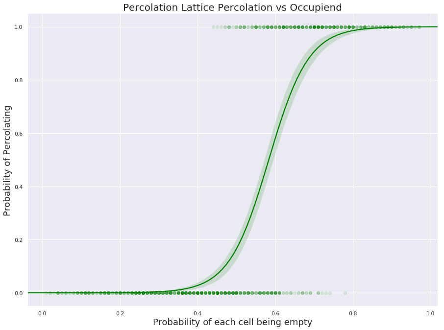

```python
from scipy.stats import beta
import seaborn as sns
from union import Union
import numpy as np
import matplotlib.pyplot as plt
```


```python
class Union:
    
    def __init__(self, size):
        self.size = size
        self.id = list(range(size))
        self.depth = [1] * size


    def root(self, i):
        while i != self.id[i]:
            self.id[i] = self.id[self.id[i]]
            i = self.id[i]
        return i


    def union(self, p, q):
        i = self.root(p)
        j = self.root(q)
        if self.depth[i] < self.depth[j]:
            self.id[i] = j
            self.depth[j] += self.depth[i]
        else:
            self.id[j] = i
            self.depth[i] += self.depth[j]


    def find(self, p, q):
        return self.root(p) == self.root(q)
```


```python
class Grid:

    def __init__(self, size, empty_prob=0.5):
        self.size = size
        self.elements = Union(size * (size + 1))
        self.matrix = [list(np.random.choice([0, 1], size, p=[empty_prob, 1-empty_prob])) for x in range(size)]
        # self.matrix = [[random.randint(0, 1) for i in range(size)] for x in range(size)]
        for row in self.matrix:
            row.append(1)
        self.flatmatrix = [item for sublist in self.matrix for item in sublist]
        self.connect_zeroes()
        self.determine_percolation()

    def connect_zeroes(self):
        for i, val in enumerate(self.flatmatrix[:-1]):
            if val == 0 and val == self.flatmatrix[i + 1]:
                self.elements.union(i, i + 1)
        for i, val in enumerate(self.flatmatrix[:-(self.size + 1)]):
            if val == 0 and val == self.flatmatrix[i + self.size + 1]:
                self.elements.union(i, i + self.size + 1)

    def determine_percolation(self):
        toprow = set(self.elements.id[:self.size])
        bottomrow = set(self.elements.id[-(self.size + 1): -1])
        if toprow.intersection(bottomrow):
            return True
        else:
            return False

    def toString(self):
        graph = []
        for row in self.matrix:
            elements = []
            for item in row:
                if item == 0:
                    elements.append('\u25a1')
                elif item == 1:
                    elements.append('\u25a0')
            graph.append(elements)
        print('\n'.join([' '.join([str(item) for item in row]) for row in graph]))


if __name__ == '__main__':
    grid_size = 10
    r = beta.rvs(2, 2, size=1000)
    r = np.around(r, 2)
    tot = 0
    perc = np.empty(0)
    prob = np.empty(0,dtype=bool)
    for each in r:
        prob = np.append(prob, each)
        grid = Grid(grid_size, each)
        tot += 1
        perc = np.append(perc, grid.determine_percolation())
    fig, ax = plt.subplots(figsize=(15,11))
    sns.regplot(x=prob, y=perc, logistic=True, scatter_kws={'alpha':0.1, 'color': 'green'}, line_kws={'color':'green'})
    print("Example Lattice")
    grid.toString()
    plt.title("Percolation Lattice Percolation vs Occupiend", fontsize=20)
    plt.xlabel('Probability of each cell being empty', fontsize=18)
    plt.ylabel('Probability of Percolating', fontsize=18)
    sns.set_style("dark")
    plt.show()
```

    Example Lattice
    ■ ■ □ ■ ■ □ ■ ■ ■ ■ ■
    ■ ■ ■ ■ □ ■ ■ ■ ■ □ ■
    □ □ ■ ■ ■ ■ □ ■ ■ ■ ■
    ■ ■ □ ■ □ ■ ■ ■ □ ■ ■
    □ □ ■ ■ ■ ■ ■ □ ■ ■ ■
    □ □ □ ■ □ ■ □ ■ ■ ■ ■
    ■ □ ■ □ □ □ □ ■ □ ■ ■
    ■ □ ■ □ ■ □ ■ ■ □ □ ■
    ■ □ ■ ■ □ ■ ■ ■ ■ □ ■
    □ □ ■ ■ ■ ■ ■ ■ □ ■ ■





```python

```
